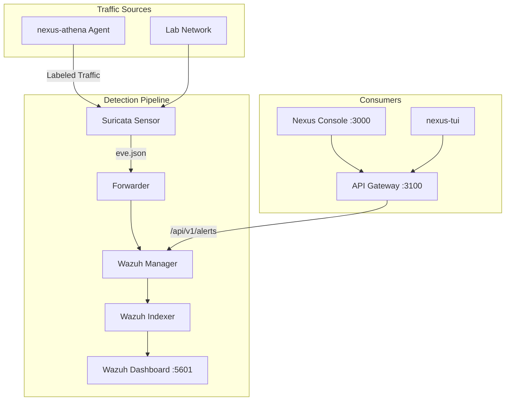

# Nexus Webtop SOC

SOC baseline stack and legacy analyst desktop for Underground Nexus. Provides the detection pipeline (Wazuh + Suricata) that receives labeled traffic from Athena agents and feeds the AI-SOC triage loop.

**Note:** The analyst desktop image in this repo is being superseded by [nexus-webtop-workbench](https://github.com/acald-creator/nexus-webtop-workbench). The primary value of this repo is the **SOC baseline compose stack**.

## Quick Start

```bash
# Start the SOC baseline stack
docker compose -f deploy/compose/soc-baseline.yml up -d

# Bootstrap OpenSearch security (first run or after down -v)
./scripts/bootstrap-wazuh-security.sh

# Validate analyst image
ANALYST_IMAGE=phoenixvlabs/nexus-webtop-soc:amd64-cg-latest ./scripts/validate-analyst-image.sh
```

**Access points:**
- Wazuh Dashboard: https://localhost:5601 (admin/admin)
- Suricata alerts: via Wazuh event pipeline

## Architecture



## Repository Layout

```
.
├── deploy/
│   └── compose/
│       └── soc-baseline.yml       # Full SOC stack (Wazuh + Suricata + analyst webtop)
├── scripts/
│   ├── bootstrap-wazuh-security.sh  # Initialize OpenSearch security
│   ├── validate-analyst-image.sh    # Acceptance gate for desktop image
│   ├── run-runtime-candidate.sh     # Build + validate Phase 2 candidates
│   └── evaluate-runtime-matrix.sh   # Run all candidate scenarios
├── docs/
│   ├── soc-baseline.md             # Operations guide
│   └── base-image-migration.md     # Phase 2 candidate evaluation
├── Dockerfile.xfce.amd64           # Primary analyst desktop (LinuxServer XFCE)
├── Dockerfile.xfce.amd64.chainguard # Chainguard transition track
├── Dockerfile.runtime-a.amd64      # Phase 2a candidate (wolfi-base, no desktop)
├── Dockerfile.runtime-b.amd64      # Phase 2b candidate
├── architecture.md                  # SOC architecture guide
└── ROADMAP.md                       # Development roadmap
```

## SOC Baseline Stack

The compose stack runs dedicated services (not embedded in the desktop):

| Service | Image | Purpose |
|---------|-------|---------|
| `wazuh.manager` | `wazuh/wazuh-manager:4.7.5` | Alert processing, rules, API |
| `wazuh.indexer` | `wazuh/wazuh-indexer:4.7.5` | Security event storage |
| `wazuh.dashboard` | `wazuh/wazuh-dashboard:4.7.5` | Analyst investigation UI |
| `suricata.sensor` | `jasonish/suricata:7.0` | Network IDS, eve.json generation |
| `webtop.analyst` | `phoenixvlabs/nexus-webtop-soc:*` | XFCE analyst desktop (legacy) |

## Integration with Athena Agents

When the Athena agent runs against targets on the same network:
1. Agent generates labeled traffic (`X-Athena-Scenario` headers)
2. Suricata captures and generates alerts
3. Wazuh ingests and indexes events
4. API Gateway queries Wazuh for alert data
5. Console/TUI displays alerts with "Simulated" tags for Athena traffic

Filter Athena traffic in Wazuh: search for `athena_scenario` field in alert metadata.

## Desktop Image Variants

| Dockerfile | Base | Status | Desktop |
|------------|------|--------|---------|
| `Dockerfile.xfce.amd64` | linuxserver/webtop | Active (legacy) | Full XFCE |
| `Dockerfile.xfce.amd64.chainguard` | linuxserver/webtop + CG hardening | Evaluation | Full XFCE |
| `Dockerfile.runtime-a.amd64` | cgr.dev/chainguard/wolfi-base | Phase 2 candidate | None (headless) |
| `Dockerfile.runtime-b.amd64` | Experimental | Phase 2 candidate | None |

## Environment Variables

| Variable | Default | Description |
|----------|---------|-------------|
| `WEBTOP_ANALYST_IMAGE` | `phoenixvlabs/nexus-webtop-soc:amd64-cg-latest` | Override analyst image in compose |
| `DOCKERFILE` | `Dockerfile.xfce.amd64` | Which Dockerfile to build |
| `PUSH` | `1` | Whether to push built image (`0` for local-only) |
| `TIMEOUT_SECONDS` | `180` | Healthcheck wait timeout for validation |

## Cross-Repo Integration

| Repository | Relationship |
|------------|-------------|
| `core-nexus` | Architecture hub — this repo must stay aligned |
| `nexus-webtop-workbench` | Recommended analyst desktop (supersedes this repo's XFCE image) |
| `nexus-athena` | Generates labeled attack traffic detected by this SOC stack |
| `athena-agents` | OPAR agent traffic source — labels must be filterable in Wazuh |
| `core-nexus/platform/api-gateway` | Queries Wazuh Manager API for alert aggregation |

## AI Collaboration

- [AGENTS.md](AGENTS.md) — Agent coding instructions
- [CLAUDE.md](CLAUDE.md) — Security review and architecture critique
- [GEMINI.md](GEMINI.md) — SOC service research and comparison
- [architecture.md](architecture.md) — SOC architecture guide

## License

See [LICENSE](LICENSE).
