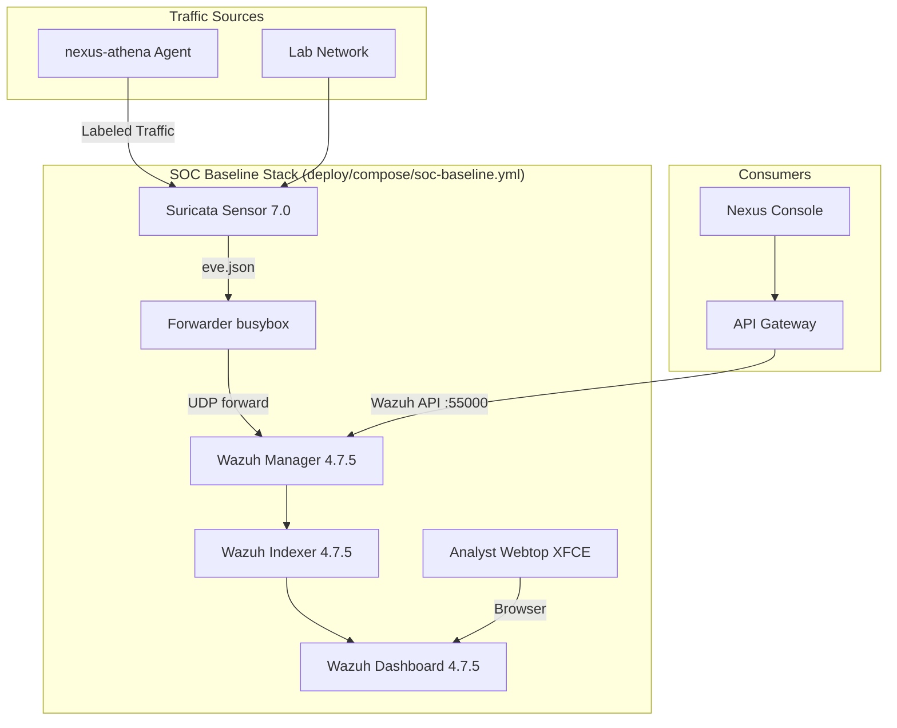

# Nexus Webtop SOC Architecture

This document describes the SOC baseline architecture for Underground Nexus. The original single-image approach (XFCE desktop with embedded Suricata) has been split into dedicated services running as a compose stack.

## 1. Current Architecture (Implemented)



### Services

| Service | Image | Port | Purpose |
|---------|-------|------|---------|
| `wazuh.manager` | `wazuh/wazuh-manager:4.7.5` | 55000, 1514, 1515 | Alert engine, rules, API, agent registration |
| `wazuh.indexer` | `wazuh/wazuh-indexer:4.7.5` | 9200 | OpenSearch-based security event store |
| `wazuh.dashboard` | `wazuh/wazuh-dashboard:4.7.5` | 5601 | Analyst investigation UI |
| `suricata.sensor` | `jasonish/suricata:7.0` | — | Network IDS, generates eve.json |
| `forwarder` | `busybox:1.36` | — | Tails eve.json, forwards to manager via UDP |
| `webtop.analyst` | `phoenixvlabs/nexus-webtop-soc:*` | 3000 | Legacy XFCE analyst desktop |

### What's Split (vs Original)

| Before (single image) | After (compose stack) |
|---|---|
| Suricata compiled inside desktop | Dedicated `jasonish/suricata:7.0` container |
| Wazuh not present | Full Wazuh stack (manager + indexer + dashboard) |
| No event pipeline | eve.json → forwarder → manager → indexer |
| Desktop was the SOC | Desktop is just a browser client |

## 2. Integration with Underground Nexus Platform

The SOC stack is one component in the broader platform:

| Layer | Component | Connection |
|-------|-----------|------------|
| Agent | nexus-athena (OPAR loop) | Generates labeled traffic on athena_lab network |
| Detection | Suricata | Captures traffic, generates eve.json alerts |
| Correlation | Wazuh Manager | Processes alerts, applies rules, enriches |
| Storage | Wazuh Indexer | Indexes events for search/investigation |
| Aggregation | API Gateway | Queries Wazuh API, serves to Console/TUI |
| Presentation | Nexus Console / nexus-tui | Displays alerts with severity coloring + Athena tags |
| Enrichment | AI Inference | Adds confidence scores and recommended actions |

### Athena Traffic Labeling

All agent-generated traffic carries identifying metadata:
- HTTP headers: `X-Athena-Scenario`, `X-Athena-Run-ID`
- Environment: `ATHENA_SCENARIO_LABEL`, `ATHENA_SCENARIO_ID`

Suricata captures these in eve.json metadata. Wazuh can decode and index them for filtering in dashboards. The API Gateway includes `athenaScenario` field in alert responses so Console/TUI can show "Simulated" tags.

## 3. Desktop Image Direction

The analyst desktop has multiple tracks:

| Track | Status | Direction |
|-------|--------|-----------|
| XFCE (LinuxServer) | Active, legacy | Browser-based investigation desktop |
| Chainguard hardened | Evaluation | Same desktop, hardened base |
| Runtime-A (wolfi-base) | Phase 2 candidate | Headless — no desktop, nginx placeholder |
| nexus-webtop-workbench | **Recommended** | Supersedes this repo's desktop for analyst profile |

Long-term: the desktop image in this repo is superseded by `nexus-webtop-workbench`. This repo's primary value becomes the **SOC compose stack** and detection engineering assets (Suricata rules, Wazuh decoders).

## 4. Security Boundaries

| Boundary | Enforcement |
|----------|-------------|
| Suricata doesn't write to host | Runs in container with no host mounts |
| Wazuh certs bootstrapped once | `bootstrap-wazuh-security.sh` initializes TLS |
| Indexer credentials | Set in compose env vars (not in image) |
| Dashboard auth | Internal certs + basic auth (admin/admin for dev) |
| Network isolation | Compose internal network; Suricata has capture access |
| Analyst desktop | Read-only access to dashboards; no SOC service control |

## 5. Operations

```bash
# Start full stack
docker compose -f deploy/compose/soc-baseline.yml up -d

# Bootstrap security (first run or after down -v)
./scripts/bootstrap-wazuh-security.sh

# Check service health
docker compose -f deploy/compose/soc-baseline.yml ps

# View Suricata alerts
docker logs suricata.sensor | tail -20

# Access Wazuh Dashboard
open https://localhost:5601
```

## 6. Detection Engineering Workflow

1. Run Athena agent against a target (generates labeled traffic)
2. Suricata generates eve.json alerts
3. Check Wazuh Dashboard for new alerts
4. Write/tune custom Suricata rules in `deploy/suricata/rules/`
5. Restart Suricata sensor to load new rules
6. Re-run agent, verify detection
7. Measure: what % of agent actions now generate alerts?

## 7. Cross-References

| Document | Location |
|----------|----------|
| SOC component architecture | `core-nexus/docs/architecture/01-component-architecture.md` Section 3 |
| Sensor deep dive | `core-nexus/docs/architecture/05-sensor-deep-dive.md` |
| AI-SOC inference engine | `core-nexus/docs/architecture/06-ai-soc-inference-engine.md` |
| Agent workflows | `core-nexus/docs/architecture/13-agent-workflows-and-memory.md` |
| API Gateway alerts route | `core-nexus/platform/api-gateway/src/routes/alerts.py` |
