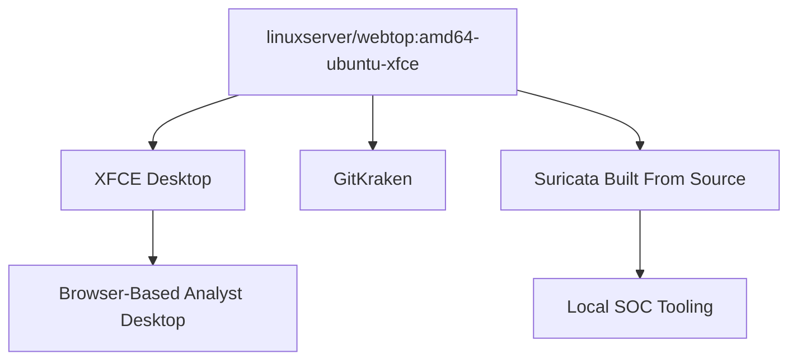
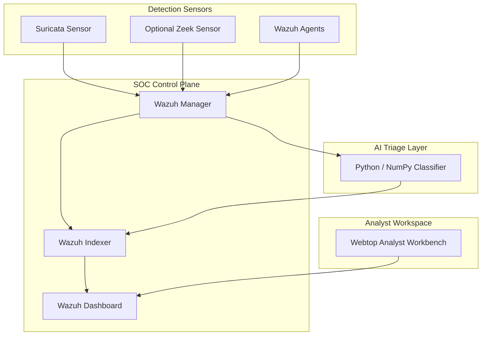

# Nexus Webtop SOC Proposed Architecture

This document proposes a revised architecture for `nexus-webtop-soc`. The current image is a single XFCE webtop container that installs GitKraken and builds Suricata from source. That design works as an analyst desktop, but it makes the SOC runtime harder to secure, update, scale, and observe.

The proposed direction is to split the SOC into purpose-built services and use Chainguard images where they are available.

## 1. Current Image

Current characteristics:

- Based on `linuxserver/webtop:amd64-ubuntu-xfce`.
- Installs desktop support packages with `apt`.
- Downloads and installs GitKraken as a `.deb`.
- Downloads Suricata source and compiles it inside the image.
- Builds only for `linux/amd64`.
- Mixes analyst desktop tooling and SOC detection runtime in one container.

## 2. Target Architecture

Target characteristics:

- **Wazuh manager** handles rules, alert processing, API access, and agent management.
- **Wazuh indexer** stores and searches security events.
- **Wazuh dashboard** provides the SOC analyst interface.
- **Wazuh agents** collect host and container telemetry.
- **Suricata** runs as a dedicated network sensor instead of being embedded in the desktop image.
- **Optional Zeek** provides protocol metadata for richer network investigation.
- **Webtop** remains an analyst workbench for browser access, notes, terminals, and optional GUI tools.
- **AI triage** consumes normalized alerts and enriches them with a threat score or false-positive probability.

## 3. Chainguard Image Strategy

Prefer Chainguard application images for SOC services when available. The main goal is to reduce custom package installation and avoid compiling production security tooling inside a GUI image.

Recommended image ownership:

| Component | Preferred approach | Notes |
| --- | --- | --- |
| Wazuh manager | Chainguard Wazuh manager image | Primary SOC event processor |
| Wazuh indexer | Chainguard Wazuh indexer image | Persistent event search layer |
| Wazuh dashboard | Chainguard Wazuh dashboard image | Analyst UI |
| Wazuh agent | Chainguard Wazuh agent image | Host and workload telemetry |
| Suricata | Dedicated minimal sensor image | Use Chainguard if available; otherwise build a minimal sensor image separately |
| Webtop | Separate analyst workbench image | Do not embed the SOC control plane in the desktop image |

## 4. What Changes From the Current Dockerfile

The current `Dockerfile.xfce.amd64` should not be directly converted into a single Chainguard image. Instead, the rewrite should separate concerns.

Remove from the SOC runtime image:

- XFCE desktop dependencies.
- GitKraken installation.
- Build toolchain packages used only to compile Suricata.
- Suricata source compilation inside the final runtime image.

Move into dedicated components:

- Wazuh services as the SOC control plane.
- Suricata as a network sensor.
- Analyst desktop tooling into a separate webtop/workbench image.
- AI scoring into a small Python service that reads Wazuh or Suricata events.

## 5. Proposed Service Flow

1. Suricata observes approved lab network traffic and emits `eve.json` events.
2. Wazuh agents collect host, container, and workload telemetry.
3. Wazuh manager receives and normalizes alerts.
4. Wazuh indexer stores searchable events.
5. Wazuh dashboard presents SOC views for analysts.
6. The AI triage service reads normalized alerts and writes enriched scores back to the event stream.
7. The webtop workbench gives analysts a browser-based desktop for investigation, documentation, and controlled tooling.

## 6. Open Design Decisions

| Decision | Recommended default | Rationale |
| --- | --- | --- |
| Primary SOC platform | Wazuh manager, indexer, dashboard, and agents | Gives the SOC a real control plane instead of a desktop image. |
| Suricata event route | Send Suricata events to Wazuh first; optionally mirror to Vector/Loki | Wazuh should own security investigation data, while Loki should remain operational logging. |
| Packet capture model | Start with Docker lab capture on `Inner-Athena`; design Kubernetes capture separately | Avoid pretending one capture model works across Docker, Kubernetes, and Istio. |
| Zeek | Later enhancement | Suricata + Wazuh is enough for the first SOC baseline. |
| Wazuh persistence | Persistent volume for indexer data | Security events need searchable retention. |
| Certificates and secrets | Vault HA or selected platform secret manager | Do not bake credentials or certificates into images. |
| AI triage schema | Require `source_event_id`, `model_version`, `score`, `label`, and `reason` | Makes enrichment traceable and testable. |
| Existing webtop image | Move to client/workbench role only | Analyst GUI should not host the SOC runtime. |

## 7. First Implementation Milestone

The first implementation should create a working SOC baseline before adding AI enrichment.

Milestone scope:

- Wazuh manager, indexer, and dashboard running as separate services.
- One Wazuh agent connected to the manager.
- One Suricata sensor generating events.
- Dashboard access from the webtop workbench.
- Documented storage, credentials, and network ports.

After that baseline is stable, add the AI triage service as a separate workload.

## 8. Network, Ports, and Volumes

The compose stack defined in `deploy/compose/soc-baseline.yml` uses the following network topology.

**Network**: `soc-net` (bridge driver). All services are on this network.

**Exposed Ports**:

| Port | Protocol | Service | Purpose |
| --- | --- | --- | --- |
| 9200 | TCP (HTTPS) | wazuh.indexer | OpenSearch API |
| 1514 | UDP | wazuh.manager | Agent/event ingestion |
| 1515 | TCP | wazuh.manager | Agent enrollment |
| 55000 | TCP (HTTPS) | wazuh.manager | Wazuh API |
| 5601 | TCP (HTTP) | wazuh.dashboard | Dashboard UI |
| 3000 | TCP (HTTP) | webtop.analyst | Analyst desktop (analyst profile only) |

**Named Volumes**:

| Volume | Service | Content |
| --- | --- | --- |
| wazuh-indexer-data | wazuh.indexer | OpenSearch indices and security events |
| wazuh-manager-data | wazuh.manager | Agent data and OSSEC runtime state |
| wazuh-manager-etc | wazuh.manager | Manager configuration (ossec.conf, rules, decoders) |
| wazuh-manager-logs | wazuh.manager | Manager and alert logs |
| suricata-logs | suricata.sensor, suricata.forwarder | Suricata eve.json and fast.log (shared) |
| webtop-analyst-config | webtop.analyst | Analyst desktop persistent config |
| soc-shared | webtop.analyst | Shared workspace between analyst and SOC services |

## 9. Current Credential State

The baseline compose stack uses intentionally simple credentials for Phase 1 lab bring-up.

- The compose stack uses `admin` / `admin` for indexer, manager-to-indexer, and dashboard authentication (defined as environment variables in `soc-baseline.yml`).
- `bootstrap-wazuh-security.sh` uses the indexer's built-in TLS certificates at `/usr/share/wazuh-indexer/certs/` (root-ca.pem, admin.pem, admin-key.pem). These are the default certs shipped in the Wazuh indexer image.
- The dashboard has `SERVER_SSL_ENABLED=false` for local lab access.
- **Target state**: Vault HA or platform secret manager. No credentials or certificates should be baked into images. This baseline uses local defaults intentionally as a Phase 1 lab configuration.

## 10. Pinned Versions

| Component | Image | Version | Notes |
| --- | --- | --- | --- |
| Wazuh indexer | wazuh/wazuh-indexer | 4.7.5 | Pinned in compose |
| Wazuh manager | wazuh/wazuh-manager | 4.7.5 | Pinned in compose |
| Wazuh dashboard | wazuh/wazuh-dashboard | 4.7.5 | Pinned in compose |
| Suricata sensor | jasonish/suricata | 7.0 | Pinned in compose |
| Suricata forwarder | busybox | 1.36 | Lightweight tail+nc bridge |
| Analyst desktop (default) | linuxserver/webtop | amd64-ubuntu-xfce | Used by Dockerfile.xfce.amd64 |
| Phase 2a candidate base | cgr.dev/chainguard/wolfi-base | latest | Used by Dockerfile.phase2a.amd64 |

> [!NOTE]
> Chainguard images listed in section 3 (Wazuh manager, indexer, dashboard, agent) are aspirational targets. As of this writing, Chainguard does not publish dedicated Wazuh application images. The `cg` track in this repo uses the LinuxServer base with reduced package footprint as a transition step, not a true Chainguard runtime.

## 11. Related Repositories

| Repository | Relationship |
| --- | --- |
| `core-nexus` | Underground Nexus architecture. This repo must stay aligned with core-nexus design decisions. |
| `nexus-webtop-workbench` | Dedicated analyst workbench image (MATE desktop). Recommended as Option A for the analyst profile in the SOC baseline. This repo's XFCE image is Option B. |
